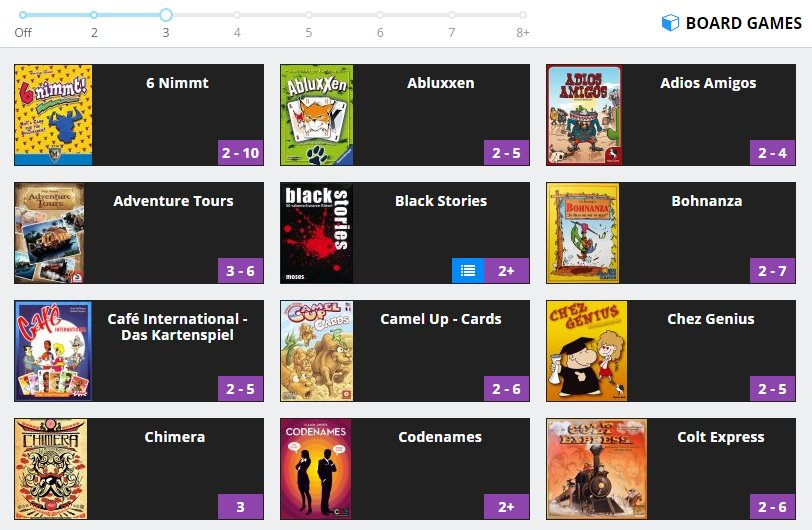

# Board Games

Categorize and publish your board games collection.

 - [Live Demo](https://darekkay.com/board-games)

## License

This project and its contents are open source under the [MIT license](LICENSE).
